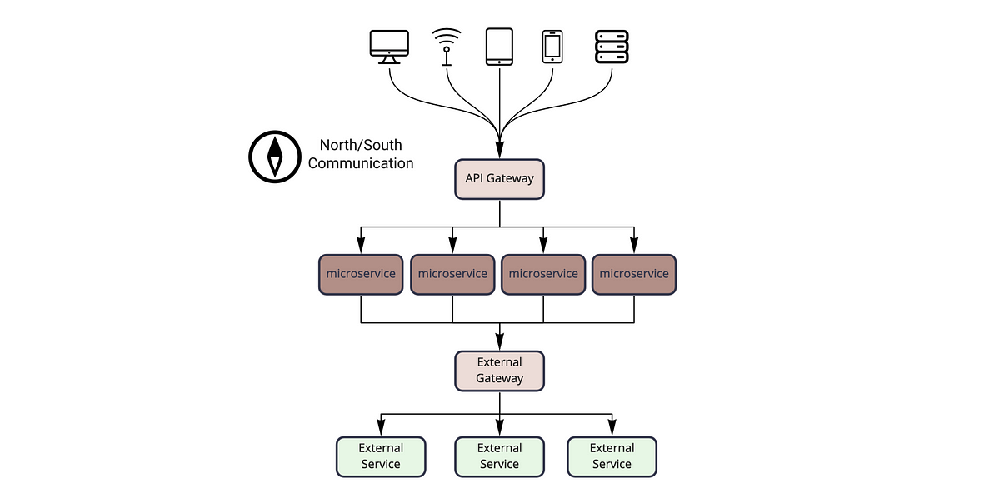
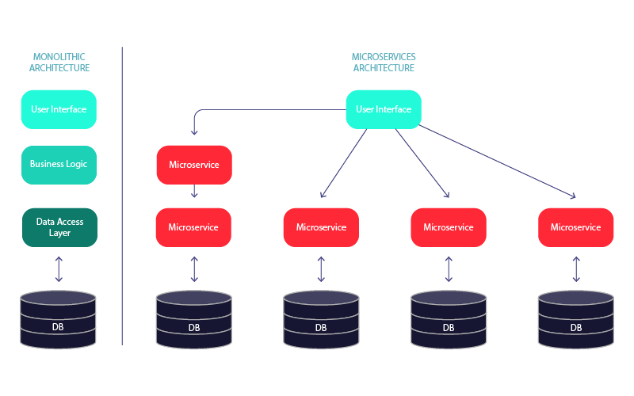

# Welcome Travelers, to my humble repository!
- Name: Azka Dwi Putra Azhad
- Class:B4CC
- ID: 2702357926

# What Are Microservices?

Microservices are an architectural approach to developing software applications as a collection of small, independent services that communicate with each other over a network. Instead of building a monolithic application where all the functionality is tightly integrated into a single codebase, microservices break down the application into smaller, loosely coupled services.

# How do Microservices work?

Microservices break complex applications into smaller, independent services that work together, enhancing scalability, and maintenance. Below is how microservixes work:

- Applications are divided into self-contained services, each focused on a specific function, simplifying development and maintenance.
- Each microservice handles a particular business feature, like user authentication or product management, allowing for specialized development.
- Services interact via APIs, facilitating standardized information exchange and integration.
- Different technologies can be used for each service, enabling teams to select the best tools for their needs.
- Microservices can be updated independently, reducing risks during changes and enhancing system resilience.

# Real-World Example of Microservices

Below are the microservices involved in Amazon E-commerce Application:

- User Service: Handles user accounts and preferences, making sure each person has a personalized experience.
- Search Service: Helps users find products quickly by organizing and indexing product information.
- Catalog Service: Manages the product listings, ensuring all details are accurate and easy to access.
- Cart Service: Lets users add, remove, or change items in their shopping cart before checking out.
- Wishlist Service: Allows users to save items for later, helping them keep track of products they want.
- Order Taking Service: Processes customer orders, checking availability and validating details.
- Order Processing Service: Oversees the entire fulfillment process, working with inventory and shipping to get orders delivered.
- Payment Service: Manages secure transactions and keeps track of payment details.
- Logistics Service: Coordinates everything related to delivery, including shipping costs and tracking.
- Warehouse Service: Keeps an eye on inventory levels and helps with restocking when needed.
- Notification Service: Sends updates to users about their orders and any special offers.
- Recommendation Service: Suggests products to users based on their browsing and purchase history

# Benefits and Challenges of using Microservices Architecture

Benefits of Using Microservices Architecture:
- Teams can work on different microservices simultaneously.
- Issues in one service do not impact others, enhancing reliability.
- Each service can be scaled based on its specific needs.
- The system can quickly adapt to changing workloads.
- Teams can choose the best tech stack for each microservice.
- Small, cross-functional teams work independently.

Challenges of using Microservices Architecture:
- Managing service communication, network latency, and data consistency can be difficult.
- Decomposing an app into microservices adds complexity in development, testing, and deployment.
- Network communication can lead to higher latency and complicates error handling.
- Maintaining consistent data across services is challenging, and distributed transactions can be complex.

# Image Example

